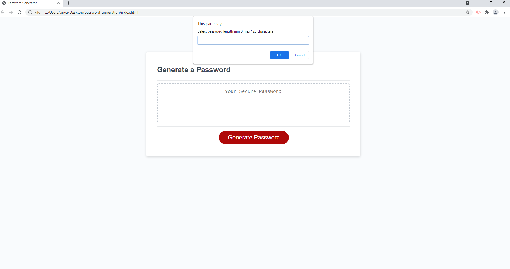
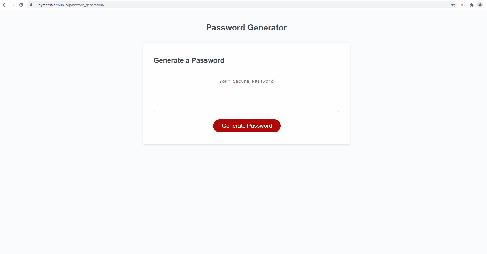

# Password_generation
* The code generates series of prompts -
* Asks the user to enter password length -validates length on several criteria
* User inputs entry for uppercase,lowercase ,special characters and/or  numbers 
* Final Password is  written to the page .
* Reference wikipedia RND generator.
* Technologies: HTML ,CSS,Javascript

* Deployed url https://judymotha.github.io/password_generation/
* GH link https://github.com/JudyMotha/password_generation

# Visuals : Screenshot and GIF 
 
 
 
 
